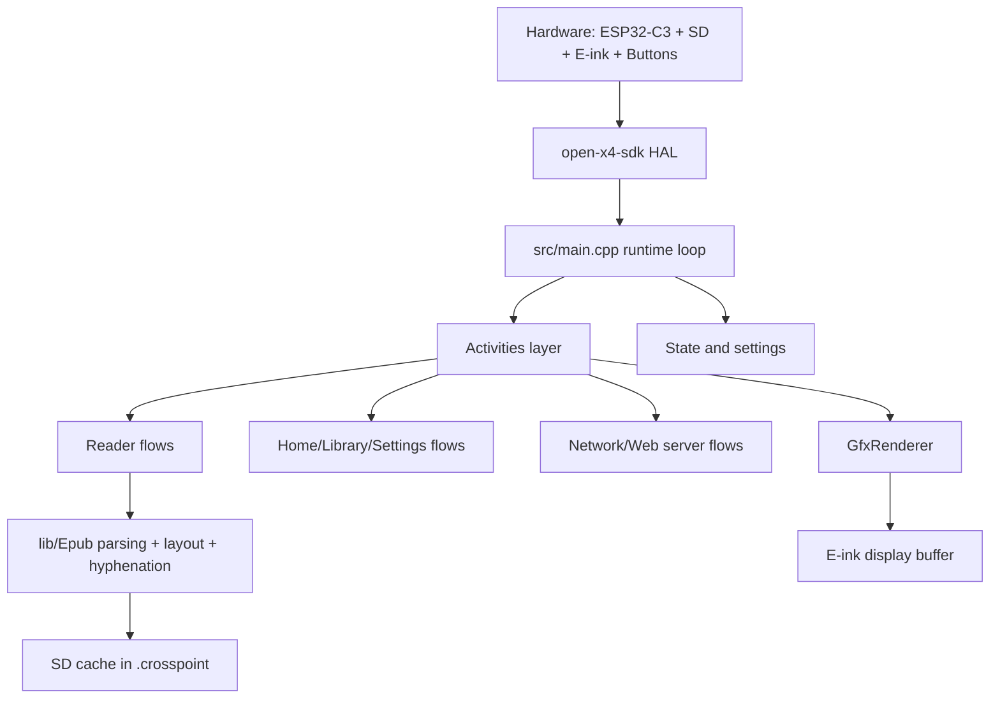
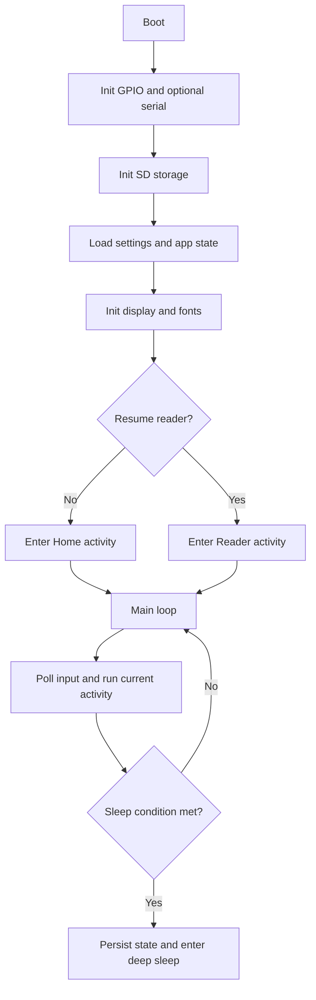
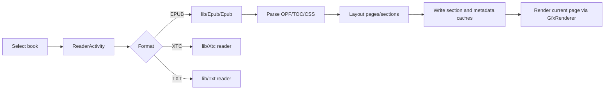
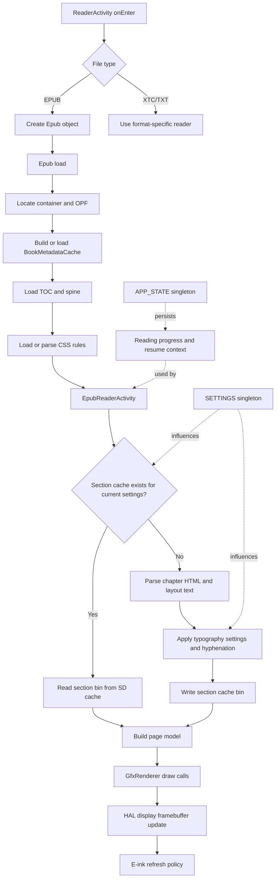

# Architecture Overview

Biscuit is firmware for the Xteink X4 (unaffiliated with Xteink), built with PlatformIO targeting the ESP32-C3 microcontroller.

At a high level, it is firmware that uses an activity-driven application architecture loop with persistent settings/state, SD-card-first caching, and a rendering pipeline optimized for e-ink constraints.

## System at a glance



## Runtime lifecycle

Primary entry point is `src/main.cpp`.



In each loop iteration, the firmware updates input, runs the active activity, handles auto-sleep/power behavior, and applies a short delay policy to balance responsiveness and power.

## Activity model

Activities are screen-level controllers deriving from `src/activities/Activity.h`.
Some flows use `src/activities/ActivityWithSubactivity.h` to host nested activities.

- `onEnter()` and `onExit()` manage setup/teardown
- `loop()` handles per-frame behavior
- `skipLoopDelay()` and `preventAutoSleep()` are used by long-running flows (for example web server mode)

Top-level activity groups:

- `src/activities/home/`: home and library navigation
- `src/activities/reader/`: EPUB/XTC/TXT reading flows
- `src/activities/settings/`: settings menus and configuration
- `src/activities/network/`: WiFi selection, AP/STA mode, file transfer server
- `src/activities/boot_sleep/`: boot and sleep transitions

## Reader and content pipeline

Reader orchestration starts in `src/activities/reader/ReaderActivity.h` and dispatches to format-specific readers.
EPUB processing is implemented in `lib/Epub/`.



Why caching matters:

- RAM is limited on ESP32-C3, so expensive parsed/layout data is persisted to SD
- repeat opens/page navigation can reuse cached data instead of full reparsing

## Reader internals call graph

This diagram zooms into the EPUB path to show the main control and data flow from activity entry to on-screen draw.



Notes:

- "section cache exists" depends on cache-busting parameters such as font and layout-related settings
- rendering favors reusing precomputed layout data to keep page turns responsive on constrained hardware
- progress/session state is persisted so the reader can reopen at the last position after reboot/sleep

## State and persistence

Two singletons are central:

- `src/CrossPointSettings.h` (`SETTINGS`): user preferences and behavior flags
- `src/CrossPointState.h` (`APP_STATE`): runtime/session state such as current book and sleep context

Typical persisted areas on SD:

```text
/.crosspoint/
  epub_<hash>/
    book.bin
    progress.bin
    cover.bmp
    sections/*.bin
  settings.bin
  state.bin
```

For binary cache formats, see `docs/file-formats.md`.

## Networking architecture

Network file transfer is controlled by `src/activities/network/CrossPointWebServerActivity.h` and served by `src/network/CrossPointWebServer.h`.

Modes:

- STA: join existing WiFi network
- AP: create hotspot

Server behavior:

- HTTP server on port 80
- WebSocket upload server on port 81
- file operations backed by SD storage
- activity requests faster loop responsiveness while server is running

Endpoint reference: `docs/webserver-endpoints.md`.

## Build-time generated assets

Some sources are generated and should not be edited manually.

- `scripts/build_html.py` generates `src/network/html/*.generated.h` from HTML files
- `scripts/generate_hyphenation_trie.py` generates hyphenation headers under `lib/Epub/Epub/hyphenation/generated/`

When editing related source assets, regenerate via normal build steps/scripts.

## Key directories

- `src/`: app orchestration, settings/state, and activity implementations
- `src/network/`: web server and OTA/update networking
- `src/components/`: theming and shared UI components
- `lib/Epub/`: EPUB parser, layout, CSS handling, and hyphenation
- `lib/`: supporting libraries (fonts, text, filesystem helpers, etc.)
- `open-x4-sdk/`: hardware SDK submodule (display, input, storage, battery)
- `docs/`: user and technical documentation

## Embedded constraints that shape design

- constrained RAM drives SD-first caching and careful allocations
- e-ink refresh cost drives render/update batching choices
- main loop responsiveness matters for input, power handling, and watchdog safety
- background/network flows must cooperate with sleep and loop timing logic

## HAL layer

The hardware SDK lives in the `open-x4-sdk/` git submodule. It provides low-level display, input, storage, and battery drivers specific to the Xteink X4 hardware. App code must never call SDK classes directly — always go through the HAL wrappers in `lib/hal/`.

| HAL class | File | Responsibility |
|-----------|------|---------------|
| `HalDisplay` | `HalDisplay.h` | Owns the e-ink panel: framebuffer, refresh modes (FULL/HALF/FAST), deep sleep |
| `HalGPIO` | `HalGPIO.h` | Button input, USB detection, deep-sleep wake, SPI bus setup, device-type detection (X3/X4) |
| `HalPowerManager` | `HalPowerManager.h` | CPU frequency scaling, battery percentage, RAII `Lock` for full-speed work |
| `HalStorage` | `HalStorage.h` | SD card I/O via thread-safe `HalFile` (aliased as `FsFile` for downstream code); `Storage` macro |
| `HalSystem` | `HalSystem.h` | Panic capture/replay, crash dump to SD |
| `HalTiltSensor` | `HalTiltSensor.h` | QMI8658 IMU driver, tilt-page-turn gesture detection, power save |
| `HalSpiBus` | `HalSpiBus.h` | Shared SPI bus arbitration between the display and SD card |

Global singleton instances are created in `src/main.cpp`: `gpio`, `display`, `storage`, `powerManager`, `halTiltSensor`.

**Why this rule exists**: the `env:simulator` build replaces the `lib/hal/` implementations with SDL2 stubs. Bypassing HAL means your code will not compile in the simulator and will be harder to test without hardware.

## Rendering pipeline

```
GfxRenderer (draw calls)
  └─ frameBuffer (48 KB heap allocation, 1 bit/pixel)
       └─ HalDisplay::displayBuffer()
            └─ EInkDisplay (open-x4-sdk) → SPI → physical e-ink panel
```

`GfxRenderer` manages a single 1-bit framebuffer (`800 × 480 / 8 = 48 000 bytes`). All drawing operations write into this buffer. When a frame is ready, `displayBuffer()` pushes the buffer to the panel via `HalDisplay`.

The `EINK_DISPLAY_SINGLE_BUFFER_MODE=1` compile flag tells the SDK to allocate only one framebuffer rather than two. This is **mandatory** on ESP32-C3: with only ~380 KB usable SRAM and no PSRAM, a second 48 KB buffer would fragment the heap and cause out-of-memory failures.

Refresh modes (set per `displayBuffer()` call):
- `FAST_REFRESH` — custom LUT, used for normal page turns; fastest but may show slight ghosting
- `HALF_REFRESH` — balanced quality/speed (~1720 ms)
- `FULL_REFRESH` — complete waveform, used for deep ghosting removal

Grayscale rendering (for anti-aliased text) uses two separate buffer passes (`GRAYSCALE_LSB` / `GRAYSCALE_MSB`), merged by the display driver.

## Font system

Fonts are loaded and rendered through two parallel systems:

**Built-in fonts** are compiled directly into flash as `static const` byte arrays in `lib/EpdFont/builtinFonts/`. They are registered in `src/main.cpp` via `renderer.insertFont(fontId, family)`. Available families: Lexend Deca (UI), Chareink (reader), and the Material Symbols Rounded icon font (see `src/components/MaterialIcons.h` for the codepoint-to-`UIIcon` table and `src/fontIds.h` for font ID constants).

**SD card fonts** are loaded at runtime via `SdCardFontSystem`. The user places `.bin` font files on the SD card; `FontCacheManager` decompresses and caches glyph data. SD font IDs coexist in the same `fontMap` as built-in fonts.

Font variants are always accessed via `EpdFontFamily` (holds regular/bold/italic/bold-italic). Pass the font ID integer and an `EpdFontFamily::Style` enum to `GfxRenderer` draw calls.

## Input model

```
HalGPIO (raw button state)
  └─ MappedInputManager (logical button abstraction, reader-mode remapping)
       └─ ButtonNavigator (list/menu navigation helper)
```

`MappedInputManager` maps physical button indices to `MappedInputManager::Button` enum values (`Back`, `Confirm`, `Left`, `Right`, `Up`, `Down`, `Power`, `PageBack`, `PageForward`). Reader mode can remap front buttons for page-turn use.

Always use `MappedInputManager::Button::*` enum values in activity code — never hardcode raw button indices from `HalGPIO`.

`ButtonNavigator` wraps a list index and handles Up/Down/PageBack/PageForward navigation with wrap-around, keeping activity code free of repetitive scroll logic.

## Radio arbitration

The ESP32-C3 has a single shared radio: WiFi and BLE cannot run simultaneously, and ESP-NOW runs on top of the WiFi radio without an IP stack.

`RadioManager` (singleton `RADIO`) is the single gatekeeper:

```
RadioState: OFF → WIFI | BLE | ESPNOW
```

| Method | What it does |
|--------|-------------|
| `ensureWifi()` | Activates WiFi STA with IP stack; tears down BLE/ESP-NOW first |
| `ensureBle()` | Activates BLE; tears down WiFi/ESP-NOW first |
| `ensureEspNow()` | Sets WiFi STA (no IP stack) + `esp_now_init()`; tears down BLE first |
| `shutdown()` | Tears down whichever radio mode is active |

Only one state is active at a time. Callers must call `shutdown()` in `onExit()` if they activated a radio mode.

NVS namespace for the RadioManager disclaimer is `"crosspoint"`.

## I18n system

Every user-visible string in the UI must use `tr(STR_KEY)`, not a hardcoded string literal. Using a hardcoded literal in UI code is a bug.

Translation source files are YAML under `lib/I18n/translations/`. Each file is one language. Running `scripts/gen_i18n.py lib/I18n/translations lib/I18n/` regenerates the C++ headers in `lib/I18n/`. This script runs automatically as a pre-build step in PlatformIO.

The `tr()` call resolves to a `const char*` at runtime. Do not pass it to functions that assume null-termination beyond the string itself (like `string_view`-based APIs).

Log messages (`LOG_INF`, `LOG_DBG`, `LOG_ERR`) may use hardcoded English strings — only user-facing text must be translated.

## Scope guardrails

Before implementing larger ideas, check:

- [SCOPE.md](../../SCOPE.md)
- [GOVERNANCE.md](../../GOVERNANCE.md)
